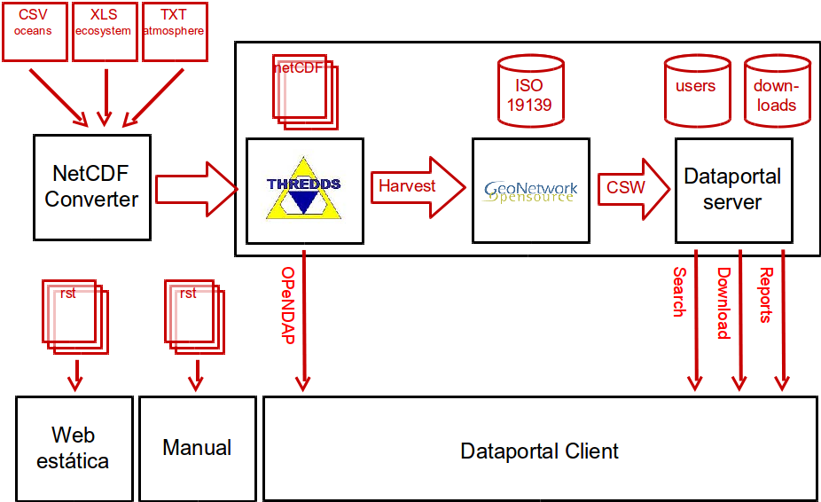
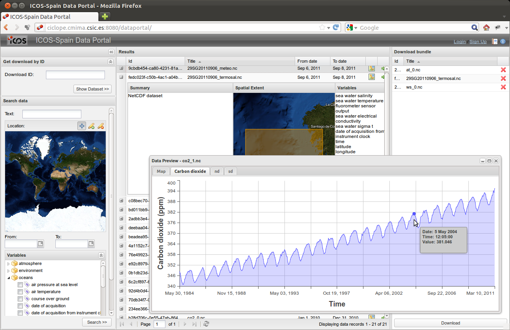

.. sectnum::

.. |geomatico| replace:: **geomati.co**
.. |TDS| replace:: *Thredds*
.. |GN|  replace:: *GeoNetwork*
.. |GS|  replace:: *GeoServer*
.. |PG|  replace:: *PostgreSQL*
.. |DP|  replace:: *Data Portal*
.. |TCT| replace:: *Tomcat*
.. |Discovery| replace:: NetCDF Attribute Convention for Dataset Discovery
.. |Crosswalk| replace:: NOAA's NetCDF Attribute Convention for Dataset Discovery Conformance Test
.. |ODbL| replace:: Open Database License
.. |CF_vocab| replace:: CF standard names v.18
.. |UTM_vocab| replace:: vocabulario usado en la UTM
.. |cdm| replace:: Tipo de datos Thredds

.. _geomatico: http://geomati.co
.. _Discovery: http://www.unidata.ucar.edu/software/netcdf-java/formats/DataDiscoveryAttConvention.html
.. _Crosswalk: https://geo-ide.noaa.gov/wiki/index.php?title=NetCDF_Attribute_Convention_for_Dataset_Discovery_Conformance_Test
.. _ODbL: http://opendatacommons.org/licenses/odbl/
.. _ISO8601: http://es.wikipedia.org/wiki/ISO_8601
.. _CF_vocab: http://cf-pcmdi.llnl.gov/documents/cf-standard-names/standard-name-table/18/cf-standard-name-table.html
.. _UTM_vocab: http://ciclope.cmima.csic.es:8080/dataportal/xml/vocabulario.xml
.. _cdm: http://www.unidata.ucar.edu/software/netcdf-java/formats/DataDiscoveryAttConvention.html#cdm_data_type_Attribute
.. _vocabulario.xml: http://ciclope.cmima.csic.es:8080/dataportal/xml/vocabulario.xml
.. _ISO8601: http://es.wikipedia.org/wiki/ISO_8601
.. _WKT: http://en.wikipedia.org/wiki/Well-known_text
.. _UTC: http://en.wikipedia.org/wiki/Coordinated_Universal_Time
.. _Luke: http://code.google.com/p/luke/downloads/list

=======================================================================================================================================
ICOS Carbon Data Portal: Repositorio integrado de mediciones sobre gases de efecto invernadero a disposición de la comunidad científica
=======================================================================================================================================

.. rubric::
   O. Fonts, M. García, F. González :sup:`(1)`, J. Piera, J. Sorribas, J. Olivé :sup:`(2)`

.. highlights::
   :sup:`(1)` Red de desarrolladores SIG independientes geomati.co. http://www.geomati.co {oscar.fonts, micho.garcia, fernando.gonzalez} @geomati.co.

   :sup:`(2)` Unidad de Tecnología Marina, Departamento de Telemática. Centro Superior de Investigaciones Científicas. http://www.utm.csic.es utmtel@utm.csic.es

.. epigraph:: **RESUMEN**

   La infraestructura europea `ICOS (Integrated Carbon Observation System) <http://www.icos-infrastructure.eu>`_, tiene como misión proveer de mediciones de gases de efecto invernadero a largo plazo, lo que ha de permitir estudiar el estado actual y comportamiento futuro del ciclo global del carbono.

   En este contexto, |geomatico|_ ha desarrollado un portal de búsqueda y descarga de datos que integre las mediciones realizadas en los ámbitos terrestre, marítimo y atmosférico, disciplinas que hasta ahora habían gestionado los datos de forma separada.

   El portal permite hacer búsquedas por múltiples ámbitos geográficos, por rango temporal, por texto libre o por un subconjunto de magnitudes, realizar vistas previas de los datos, y añadir los conjuntos de datos que se crean interesantes a un “*carrito*” de descargas.

   En el momento de realizar la descarga de una colección de datos, se le asignará un identificador universal que permitirá referenciarla en eventuales publicaciones, y repetir su descarga en el futuro (de modo que los experimentos publicados sean reproducibles).

   El portal se apoya en formatos abiertos de uso común en la comunidad científica, como el formato `NetCDF <http://www.unidata.ucar.edu/software/netcdf/>`_ para los datos, y en el `perfil ISO de CSW <http://www.opengeospatial.org/standards/cat>`_, estándar de catalogación y búsqueda propio del ámbito geoespacial. El portal se ha desarrollado partiendo de componentes de software libre existentes, como `Thredds Data Server <http://www.unidata.ucar.edu/projects/THREDDS/>`_, `GeoNetwork Open Source <http://geonetwork-opensource.org/>`_ y `GeoExt <http://geoext.org/>`_, y su código y documentación quedarán publicados bajo una licencia libre para hacer posible su reutilización en otros proyectos.

   **Palabras clave:** ICOS, Carbon, data portal, Thredds, Geonetwork.

Introducción
============

ICOS
----

Los objetivos de la infraestructura europea ICOS [#]_ son:

.. [#] Integrated Carbon Observation System

* Realizar las observaciones, a largo plazo, necesarias para comprender el estado actual y predecir el comportamiento futuro del ciclo global del carbono y las emisiones de gases de efecto invernadero.

* Observar y evaluar la efectividad de la fijación de carbono y/o las actividades de reducción de las emisiones de gases de efecto invernadero en los niveles de composición global atmosférica, incluyendo la atribución de fuentes y sumideros por región y por sector.

Para ello se establecerá una red de observación sistemática a largo plazo, diseñada alrededor de unas instalaciones centrales, constituida por estaciones de medidas de alta precisión dedicadas a la monitorización de los flujos de los GEIs [#]_ de los ecosistemas terrestres y su concentración en la atmósfera, así como de los intercambios de CO:sub:`2` entre la atmósfera y los océanos. Las observaciones proporcionadas permitirán a los investigadores conseguir una plena comprensión de los intercambios de los GEIs sobre el continente europeo y de sus causas.

.. [#] Gases de Efecto Invernadero

Portal de datos ICOS-Spain
--------------------------

En el contexto de ICOS, |geomatico| ha desarrollado un portal de datos que sirva como punto de acceso unificado a los datos proporcionados por la parte española de su infraestructura. Dicho portal es el que se describe en este artículo.

DataPortal permite:

* La agregación de datos procedentes de distintas áreas temáticas, convirtiéndolos a un formato común NetCDF, y su publicación en línea en uno o más repositorios mediante el uso del servidor Thredds Data Server.

* La extracción de metadatos e indexación en un catálogo ISO 19119 mediante el uso de GeoNetwork.

* El acceso a dichos datos mdiante una aplicación web. La aplicación permite:

  * Búsqueda en el repositorio de datos, combinando los siguientes criterios:

    * Texto libre.
    * Uno o más ámbitos geográficos definidos como cajas contenedoras (*bounding boxes*).
    * Rango temporal en que se capturaron los datos.
    * Un conjunto de variables procedentes de un vocabulario controlado.

  * Previsualización de los resultados, entre los que destaca la posibilidad de inspeccionar los propios datos de forma gráfica antes de su descarga.

  * Selección de los conjuntos de datos que se desea descargar (al modo de un *carrito de la compra*).

  * Descarga de los datos, para lo que se requiere un registro previo de los usuarios.

  * Reproductibilidad de las descargas, a las que se asigna un identificador universal para ser referenciadas en posibles publicaciones.

  * Generación de informes estadísticos sobre el uso del propio portal de datos.

Componentes del portal de datos
-------------------------------

El desarrollo de DataPortal se ha basado en la reutilización de componentes de software libre y estándares abiertos de amplia implantación entre la comunidad científica y la industria geoespacial, y es a su vez un proyecto de software libre que esperamos poder poner a disposición de la comunidad a la mayor brevedad posible.

   Componentes del portal de datos.

Como se observa en la figura, los datos de partida están contenidos en ficheros de texto plano, en formato CSV o Excel, cuyo formato y especificación dependen del área temática de los que proceden.

La primera etapa consiste en la conversión de los distintos tipos de datos a uno común mediante un importador extensible a nuevos formatos. Una vez convertidos a un formato común, los datos se publican en la red mediante Thredds. La siguiente etapa (GeoNetwork) se encarga de extraer e indexar los metadatos necesarios, y de servirlos mediante estándares CSW e ISO.

DataPortal es la aplicación desarrollada ad-hoc para proporcionar una interfaz de usuario suficientemente rica y simple, y se divide en la parte servidora, que proporciona una serie de servicios web (búsqueda, descarga, autenticación, generación de estadísticas), y la parte cliente, que se ejecuta en el navegador del cliente, y que proporciona la interactividad necesaria para la selección, evaluación y descarga reproductible de los datos.

Para la documentación de la aplicación se ha utilizado el formato ReStructuredText. 

Formato de los datos
====================

Se ha optado por el uso de NetCDF como formato común de los datos por tratarse de un formato:

* Abierto, cuya especificación es pública.
* Ampliamente utilizado por la comunidad científica, para el que existen decenas de aplicaciones de visualización y manipulación ya disponibles.
* Simple, que se basa en unos pocos conceptos muy básicos, y para cuya utilización no hace falta definir de antemano modelos de datos complejos.
* Compacto, puesto que la codificación de los datos es binaria, y el propio formato introduce muy poco *overhead*.
* Versátil, capaz de contener datos puntuales, series temporales, trayectorias, imágenes ráster (grid), todo ello con capacidad multidimensional, y pudiendo definir relaciones entre las variables.
* Potente, puesto que cada variable tiene asociada una serie de metadatos según convenciones desarrolladas en base a buenas prácticas, y que proporcionan información sobre el ámbito, granularidad, o unidades de cada una de las variables contenidas en los datos.

Metadatos
---------

El *Data Portal* puede realizar búsquedas por ámbito geográfico, período temporal, conjunto de variables, o por texto libre, dentro de un conjunto de ficheros netCDF. Para que los datos originales sean recuperables mediante estos criterios, es necesario que éstos estén convenientemente descritos y puedan extraerse las variables que permitirán su búsqueda al final del fluji.

A tal efecto, se han seguido un subconjunto de las convenciones ya existentes para datos en el ámbito de la observación climática y predicción meteorológica [#]_, y para el descubrimiento de los datos [#]_.

.. [#] Climate & Forecast 1.5: http://cf-pcmdi.llnl.gov/documents/cf-conventions/1.5/cf-conventions.html
.. [#] NetCDF Attribute Convention for Dataset Discovery: http://www.unidata.ucar.edu/software/netcdf-java/formats/DataDiscoveryAttConvention.html

En concreto, los datos NetCDF incluidos en la aplicación netCDF deberán contener los siguientes atributos globales:

.. table:: Propuesta de atributos globales NetCDF mínimos para Data Portal

  ========================  ==========================================
  Atributo                  Descripción
  ========================  ==========================================
  Metadata_Conventions      Literal: "Unidata Dataset Discovery v1.0".
  id                        Identificador de este dataset. Un UUID.
  title                     Descripción concisa del conjunto de datos.
  summary                   Un párrafo describiendo los datos con
                            mayor detalle.
  standard_name_vocabulary  Idealmente se usaría un vocabulario
                            estándar como [#]_.
                            En caso de utilizar un vocabulario propio,
                            indicar la URL donde pueda descargarse el
                            vocabulario.
  geospatial_lat_min        Límites geográficos en los que están
                            contenidas las medidas, coordenadas
                            geográficas en grados
                            decimales, sistema de referencia WGS84
                            (EPSG:4326).
  geospatial_lat_max        *idem*
  geospatial_lon_min        *idem* 
  geospatial_lon_max        *idem*
  time_coverage_start       Instante del dato más remoto, en formato
                            ISO8601_.
  time_coverage_end         Instante del dato más reciente, en formato
                            ISO8601_.
  institution               Institución que publica los datos.
  cdm_data_type             |cdm|_. Uno de "Grid", "Image", "Station",
                            "Radial" o "Trajectory".
  icos_domain               Atributo propio (no responde a ninguna
                            convención), que necesitaremos a efectos
                            estadísticos. Área temática
                            de ICOS de la que proceden los datos.
  ========================  ==========================================
 
.. [#] CF Standard names: http://cf-pcmdi.llnl.gov/documents/cf-standard-names/standard-name-table/18/cf-standard-name-table.html

A lo largo de la aplicación, estos **atributos netCDF** se transformarán en una **fichas ISO** en un proceso de harvesting. El servicio de **búsqueda** permitirá filtrar por alguno de estos conceptos vía **parámetros de búsqueda**, que se convertirán en un **request CSW**, y que dará lugar a unos **resultados de búsqueda**. Estos resultados, además, serán **ordenables** por alguno de los parámetros.

Así pues, cabe especificar qué forma tomará cada metadato las diferentes etapas de la aplicación, según el estándar o convención seguido en cada una de ellas.

.. list-table:: Equivalencia entre los nombres de los metadatos cada componente de la aplicación
   :header-rows: 1
   :widths: 15 22 15 15
   
   * - netCDF global attribute
     - ISO 19115:2003/19139
     - Search request param
     - CSW Filter
   * - id
     - //gmd:fileIdentifier
     - -- (no se busca por id, de momento)
     - Operación *getRecordById*.
   * - title
     - //gmd:CI_Citation/gmd:title
     - text (texto libre)
     - any
   * - summary
     - //gmd:CI_Citation/gmd:abstract
     - text (texto libre)
     - any
   * - geospatial_lat_min, geospatial_lat_max, geospatial_lon_min, geospatial_lon_max
     - //gmd:EX_GeographicBoundingBox
     - bboxes (múltiples)
     - OGC BBOX filter
   * - time_coverage_start
     - //gmd:EX_TemporalExtent/gmd:extent/gml:TimePeriod/gml:beginPosition
     - start_date
     - TempExtent_begin
   * - time_coverage_end
     - //gmd:EX_TemporalExtent/gmd:extent/gml:TimePeriod/gml:endPosition
     - end_date
     - TempExtent_end
   * - variables (*no son atributos*)
     - //gmd:MD_Band/gmd:sequenceIdentifier
     - variables (multiselect)
     - ContentInfo
   * - institution
     - 	//gmd:CI_ResponsibleParty
     - -- (no se busca por institucion)
     - -- (no se filtra por institucion)
   * - cdm_data_type
     - //gmd:MD_SpatialRepresentationTypeCode
     - -- (no se busca por tipo)
     - -- (no se filtra por tipo)
   * - icos_domain
     - //gmd:MD_TopicCategoryCode
     - -- (no se busca por área temática)
     - -- (no se filtra por área temática)
     
Estructura de los datos
-----------------------

Climate and Forecast (en adelante, CF) es una convención que define ciertas normas y recomendaciones para los contenidos de los ficheros NetCDF. En la medida en que CF cubra nuestras necesidades, de utilizará dicha convención en su versión 1.5.

Atributos de cada variable
..........................

Para cada variable se especificará el atributo *units*, que, idealmente, sería una de las especificadas en la convención CF (fichero udunits.dat del programa Udunits de Unidata). En caso de que el publicador de los datos no haya seguido esta convención, se tratará el atributo *units* como una cadena de texto libre. 

Se especificará un atributo *standard_name* que referenciará la entrada en el vocabulario de la variable que se está midiendo. 

Para las variables coordenadas se seguirá CF y se especificarán los atributos *units*, *standard_name* y *axis*. Las unidades para
latitud y longitud serán siempre "degrees_north" y "degrees_east" respectivamente. Se considera la utilización de un único sistema de referencia, por simplicidad. El sistema común será el WGS84 y no se incluirá información sobre el CRS dentro del fichero.

Para la coordenada tiempo se seguirá también CF.

Las variables que sean calculadas como una media, incluirán un atributo 
*mean_desc* y *mean* que contendrán respectivamente una descripción de
la media y los nombres, separados por un espacio, de las dos variables
que contienen el número de elementos que se usaron para calcular la
media (*nd*) y la desviación típica (*sd*).

Estas variables tendrán la misma forma (*shape*) y por tanto, el mismo número de
valores, que la variable media. Esto es así porque cada valor de la variable media
se corresponde con el valor en la misma posición de cada una de las variables
auxiliares.

Además, con el fin de poder identificar las variables *nd* y *std* sin 
tener que buscar atributos *mean* en todas las variables, estas incorporarán un atributo *mean_role* con valor "nd" o "std". Por ejemplo::

	dimensions:
	 station = 10 ; // measurement locations
	 time = UNLIMITED ;
	variables:
	 float co2(time,station) ;
	  co2:long_name = "carbon dioxide" ;
	  co2:coordinates = "lat lon" ;
	  co2:mean = "nd sd"
	  co2:mean_desc = "Hourly data means of 10 minutes means"
	 int nd(time,station) ;
	  nd:mean_role = "nd"
	 int sd(time,station) ;
	  sd:mean_role = "sd"
	 double time(time) ;
	  time:long_name = "time of measurement" ;
	  time:units = "days since 1970-01-01 00:00:00" ;
	 float lon(station) ;
	  lon:long_name = "station longitude";
	  lon:units = "degrees_east";
	 float lat(station) ;
	  lat:long_name = "station latitude" ;
	  lat:units = "degrees_north" ;

Series temporales de datos estacionarios
........................................

La variable tiene, en lugar de dimensiones latitud y longitud, una dimensión que identifica la posición de la medida. Variables coordenada auxiliares dan la latitud y longitud para cada posición. En el siguiente ejemplo se puede ver como una de las dimensiones de "humidity" es "station" y que las variables lat y lon tienen como única dimensión "station". Es decir, existe un valor de lat/lon para cada valor de station::

	dimensions:
	 station = 10 ; // measurement locations
	 pressure = 11 ; // pressure levels
	 time = UNLIMITED ;
	variables:
	 float humidity(time,pressure,station) ;
	  humidity:long_name = "specific humidity" ;
	  humidity:coordinates = "lat lon" ;
	 double time(time) ;
	  time:long_name = "time of measurement" ;
	  time:units = "days since 1970-01-01 00:00:00" ;
	 float lon(station) ;
	  lon:long_name = "station longitude";
	  lon:units = "degrees_east";
	 float lat(station) ;
	  lat:long_name = "station latitude" ;
	  lat:units = "degrees_north" ;
	 float pressure(pressure) ;
	  pressure:long_name = "pressure" ;
	  pressure:units = "hPa" ;

Trayectorias
............

El mismo caso que el anterior pero la variable tiene una dimensión temporal y existen variables coordenada auxiliares que dan la latitud, longitud y coordenada vertical para cada valor de tiempo.

En el siguiente ejemplo está la variable coordenada "time" que es la dimensión de todas las variables coordenada auxiliares: lat, lon y z::

	dimensions:
	 time = 1000 ;
	variables:
	 float O3(time) ;
	  O3:long_name = "ozone concentration" ;
	  O3:units = "1e-9" ;
	  O3:coordinates = "lon lat z" ;
	 double time(time) ;
	  time:long_name = "time" ;
	  time:units = "days since 1970-01-01 00:00:00" ;
	 float lon(time) ;
	  lon:long_name = "longitude" ;
	  lon:units = "degrees_east" ;
	 float lat(time) ;
	  lat:long_name = "latitude" ;
	  lat:units = "degrees_north" ;
	 float z(time) ;
	  z:long_name = "height above mean sea level" ;
	  z:units = "km" ;
	  z:positive = "up" ;

Catálogo en |GN|
================

|GN| será nuestro catálogo de metadatos y el verdadero motor del servicio de búsquedas. Para ello, es necesario configurarlo para que:

* Realice la recolección de metadatos NetCDF accediendo a |TDS|.
* Indexe los campos por los que se quiere buscar, para que las búsquedas sean eficientes.
* Exponga los metadatos por los que nos interesa filtrar o que se desea obtener a través de la interfaz CSW.

Harvesting de Thredds
---------------------

Para generar la información que necesitamos para el |DP|, debemos configurar el proceso de harvest de manera que este extraiga la información asociada a los datasets configurados en el servidor |TDS| siguiendo la NetCDF Attribute Convention for Dataset Discovery. Para ello a partir de la versión 2.7 de |GN| se implementa la posibilidad de utilizar fragmentos para la extracción y reutilización de esta información extraida en el proceso de harvest. Esta posibilidad solo está disponible para extracción de información de catalogos |TDS| y operaciones getFeature del protocolo WFS. Utilizando los fragmentos podremos extraer exclusivamente la información que requiere el |DP| para el proceso de busquedas implementado a través de |GN|. Podremos definir plantillas con los fragmentos que nos interesan que serán guardados en |GN| como **subplantillas** (subtemplates), a seleccionar en las opciones del proceso de harvest, y estos fragmentos que generarán estas subplantillas serán insertados en una plantilla que generará el registro (**plantilla base**) con el metadato en |GN|.

Esta es la plantilla base que se generará por cada registro que se incluya en |GN|. Se trata de una plantilla tipica de la ISO19139. La diferencia fundamental, es que asociado a determinados elementos de la ISO, aparece el atributo ``id=<identificador del fragmento>``. Esta es la manera en que se indica que durante el proceso de creación del metadato en |GN|, busque el identificador en la subplantilla que hemos seleccionado al crear el proceso de harvest. Por eso para crear la plantilla base, lo único que debemos hacer es sustituir los elementos que estemos interesados en crear mediante fragmentos, por una llamada a través del ``id`` al del fragmento que estamos interesados en incluir::

	<gmd:date id="thredds.resource.dates"/>
	<gmd:abstract id="thredds.abstract"/>
	<gmd:credit id="thredds.credit"/>
	<gmd:descriptiveKeywords id="thredds.keywords"/>
	<gmd:resourceConstraints id="thredds.use.constraints"/>
	<gmd:aggregationInfo id="thredds.project"/>

y en la subplantilla definiremos los fragmentos y les indicaremos el ``id`` al que la pantilla hace referencia.

Estas subplantillas, a diferencia de las plantillas base, se tratan de hojas XSL que serán ejecutadas durante la creación del metadato. La manera de definir el fragmento de metadato en una subplantilla es::

	<replacementGroup id="thredds.supplemental">
	<fragment uuid="{util:toString(util:randomUUID())}" title="{concat($name,'_contentinfo')}">
	...
	</fragment>
	</replacementGroup>

Indexación en Lucene
--------------------

|GN| incluye el motor de búsqueda Apache Lucene para realizar búsquedas dentro del catálogo. Lucene está configurado para que estas búsquedas puedan ser realizadas por unos determinados campos. Para conseguir realizar búsquedas por un tipo de campos no incluidos, habrá que modificar |GN|.

En primer lugar indicaremos que nuevos campos han de ser indexados. Para ello en cada carpeta de esquema existe un archivo ``index-fields.xsl`` en el que se indica que campos han de ser indexados. La ruta para el esquema ISO19139 con el que estamos trabajando en el |DP| será::

	/var/lib/tomcat6/webapps/geonetwork/xml/schemas/iso19139/index-fields.xsl

Este archivo se trata de una plantilla XSLT que se encarga de extraer datos de nuestros metadatos en incluirlos en el índice de Lucene. Para realizar esta acción, debemos indicar que valores queremos que se incluyan en el índice, el nombre del campo en los que se incluirá y una serie de parametros que indican como han de incluirse estos:

* **store**: guarda el valor del campo en el índice
* **index**: indexa el campo, casi siempre será ``true``
* **token**: extrae el valor del campo en pequeños trozos (tokens)::
	
	P.ej.: 'es un valor de campo' --> 'es','un','valor','de','campo'

El fragmento de plantilla que debe quedar trás la ejecución de la plantilla será::

	<Field name="<nombre del campo>" string="{<valor del campo>}"
	store="true" index="true"
	token="true"/>

Así estamos indicando que cree un campo ``<nombre del campo>`` en el índice y que incluya el valor ``<valor del campo>`` en el mismo. Esta última será una expresión XPATH que recoja del metadato en el esquema que estamos trabajando, la información que nos interesa. En el caso del |DP| quedaría de la siguiente manera::

	<xsl:for-each select="//gmd:contentInfo/gmi:MI_CoverageDescription/gmd:dimension">
	<Field name="variable" token="false" store="true" index="true" string="{string(gmd:MD_Band/gmd:sequenceIdentifier/gco:MemberName/gco:aName/gco:CharacterString)}" />
	</xsl:for-each>

Así estamos indicando que para cada valor que aparezca de ``gmd:Dimension`` incluya este en un campo denominado ``variable`` en el índice. 
Una vez que hemos modificado el archivo ``index-fields.xsl`` debemos re-indexar todos los metadatos con la nueva disposición. Para ello iremos a la sección **Index settings** de la ventana de administración y en ``Rebuild Lucene index`` indicaremos ``Rebuild``. Esta operación tardará en función del número de metadatos que tengamos en el servidor.

Adecuación de la interfaz CSW
-----------------------------

Una vez que hemos indexado el campo de búsqueda, debemos incluir este como campo soportado en las búsquedas a través del servicio CSW. Para ello modificaremos el archivo config-csw.xml que se encuentra en::

	$TOMCAT_HOME/webapps/geonetwork/WEB-INF/config-csw.xml

Debemos añadir dentro de los campos	``Additional queryable properties`` la linea que incluya nuestro campo como consultable. Para ello añadiremos en esa sección::

	<parameter name="<Nombre del campo dentro del esquema>" field="<nombre del campo incluido en el índice>" type="SupportedISOQueryables" />

Que para el caso del |DP| quedaría::

	<parameter name="ContentInfo" field="variable" type="SupportedISOQueryables" />

De esta manera, si consultamos del GetCapabilities del servidor observaremos si el campo ha sido incluido::

	<ows:Constraint name="SupportedISOQueryables">
	...
	<ows:Value>ContentInfo</ows:Value>
	...

Ya tendremos preparado nuestro servidor para realizar consultas por ``ContenInfo``.

Aplicación |DP|
===============

Servicio de Búsqueda
--------------------

Las peticiones de búsqueda se harán mediante una peticion HTTP GET o POST a la siguiente url::

  [url_base]/search

Donde [url_base] es la URL donde está desplegada la aplicación. Tanto los parámetros de la petición como las respuestas se codificarán siempre en **UTF-8**.

Parámetros entrada
..................

Los parámetros que debe aceptar el servicio pueden dividirse en *parámetros de búsqueda*, *parámetros de paginación* y *parámetros de ordenación*.

Los *parametros de búsqueda* son:

- **text**: Texto libre, a buscar entre cualquiera de los metadatos de tipo textual. Codificado en UTF-8.
- **bboxes**: Lista de bounding boxes en EPSG:4326 expresada como un array, de formato::
  
  [[Xmin0,Ymin0,Xmax0,Ymax0],[Xmin1,Ymin1,Xmax1,Ymax1],...,[XminN,YminN,XmaxN,YmaxN]]
      
- **start_date**: Formato "YYYY-MM-DD" (formato de fecha de calendario ISO8601_).
- **end_date**: Formato "YYYY-MM-DD" (formato de fecha de calendario ISO8601_).
- **variables**: Lista de variables separada por comas, de entre una lista controlada de valores. Los posibles valores son los distintos <nc_term> en `vocabulario.xml`_. Ejemplo::

  "sea_water_salinity,sea_water_temperature,sea_water_electrical_conductivity"
      
- **response_format**: Formato MIME en que se solicita la respuesta. De momento sólo está definido el formato *text/xml*.

*Parámetros de paginación*:

- **start**: Primer registro solicitado (offset, comenzando a contar por cero).
- **limit**: Número máximo de resultados por página.
  
Por ejemplo, para solicitar la 3ª página a 20 resultados por página, los parámetros serían: *start=40* y *limit=20*.
  
*Parámetros de ordenación*:
  
- **sort**: nombre del campo por el que se ordenan los elementos de la respuesta. Los posibles valores son:
  - "id",
  - "title",
  - "start_time", y
  - "end_time".
- **dir**: "ASC" (orden ascendente) o "DESC" (orden descendente).

Por ejemplo, para obtener los registros más recientes primero, los parámetros serían: *sort=start_time* & *dir=DESC*.

Formato salida
..............

- Flag **success**. Será *true* si todo ha ido bien, o *false* si ha habido algún error realizando la petición.
  
- Atributo global **totalcount**. Se refiere al número total de resultados que cumplen los criterios de búsqueda, no contenidos en una respuesta específica. Por ejemplo, en una respuesta paginada donde se devuelvan 20 resultados por página, **totalcount** puede ser 1200 (así, toda la respuesta ocuparía 60 páginas de resultados).
  
- Lista de resultados. Cada uno de ellos tendrá los siguientes elementos:

  - **id**: Identificador.
  - **title**: Título.
  - **summary**: Resumen.
  - **geo_extent**: Ámbito geográfico, expresado en WKT_. Se considerarán sólamente las primitivas geométricas 2D "POINT", "LINESTRING", "POLYGON" y "MULTIPOLYGON", expresadas en coordenadas geográficas WGS84 (EPSG:4326). Generalmente se tratará de un "POLYGON" de 4 vértices describiendo un BBOX.
  - **start_time** y **end_time**, en formato ISO8601_. Fracción horaria expresada en UTC_ (aka "Z").
  - **variables**: Lista de variables contenida en el dataset, separada por comas. Se espera que corresponda a una lista controlada de valores. Los posibles valores son los distintos <nc_term> de `vocabulario.xml`_.
  - **data_link**: Enlace a los datos.
   
En caso de error, el flag **success** será *false*, y la respuesta contendrá un error con los siguientes elementos:

- **code**: Código del error. A criterio del desarrollador, debería servir para determinar la causa.
- **message**: Mensaje amable para mostrar al usuario frustrado.
    

Interfaz de usuario
-------------------

En la siguiente figura observamos el aspecto de la aplicación:

   Interfaz de |DP|.

Se ha utilizado el framework javascript ExtJS4 para definir los distintos componentes:

* Formulario de búsqueda en la columna izquierda, que incluye, entre otros, un componente mapa procedente de GeoEXT.
* Lista de resultados en la parte central, con paginación de resultados, ordenación por diversos campos, y despliegue de detalles, entre los que encontramos otro componente de mapa. Para cada elemento es posible:

  * Añadir elementos al listado de de descarga.
  * Previsualizar los datos de forma interactiva. Se abrirá una ventana con varias pestañas, entre las que aparecerán una vista de mapa si los datos disponen de georreferenciación, y gráficas para cada una de las variables que representen series temporales.

* Listado de descarga, a modo de *carrito de la compra*.

Meta
====

Enlaces:

Un `enlace inline <http://geomati.co>`_,

Un `enlace externo`_.

.. _`enlace externo`: http://geomati.co

------------

Referencias:

  Notas a pie [#]_ autonuméricas [#]_.

.. [#] Primera nota a pie.
.. [#] Segunda nota a pie.

------------

Citar código::

  $ java -version

------------

Tablas:

TODO: Cambiar estilo headers

.. table:: Título de tabla

    =========== =============
    Name        Value
    =========== =============
    Dave        Cute
    Mona        Smart
    =========== =============

.. csv-table:: Tabla como CSV
   :header: "Treat", "Quantity", "Description"
   :widths: 15, 10, 30

   "Albatross", 2.99, "On a stick!"
   "Crunchy Frog", 1.49, "If we took the bones out, it wouldn't be
   crunchy, now would it?"
   "Gannet Ripple", 1.99, "On a stick!"

------------

Figuras:

(rst2odt no va a aceptar ni pdf ni svg, asi que todo en png)

   Esto es el título de la figura.

------------

Sustituciones:

Esto es un |tlqsr|.

.. |tlqsr| replace:: texto largo que se repite

