.. sectnum::

.. |geomatico| replace:: **geomati.co**
.. |GS| replace:: **GeoServer**

.. _geomatico: http://geomati.co
.. _GS: http://geoserver.org

======================================
Geoserver, más allá de un servidor WMS
======================================

.. rubric::
   M. García, O. Fonts, V. González :sup:`(1)`

.. highlights::
   :sup:`(1)` |geomatico|_, red de desarrolladores SIG, info@geomati.co

.. epigraph:: **RESUMEN**

   |GS|_ es un servidor de mapas open source escrito en Java que permite a los usuarios compartir y editar información geoespacial usando estándares abiertos. En efecto, implementa varios estándares definidos por el Open Geospatial Consortium (OGC), como por ejemplo el archiconocido Web Map Service (WMS).

   Sin embargo, GeoServer ofrece muchas más funcionalidades que la implementación del estándar WMS. En el presente artículo se pretende dar un repaso a esas otras funcionalidades menos conocidas pero igualmente útiles y potentes que GeoServer incorpora.

   Para empezar se describirán brevemente los otros estándares más conocidos para servir datos: Web Feature Service (WFS) y Web Coverage Service (WCS).

   Algo menos conocido es la integración de Geowebcaché que permite cachear teselas de mapas para optimizar el servicio de las imágenes que componen los mapas, sirviéndolas mediante una interfaz estándar como WMTS.

   Web processing Service (WPS) ha sido incorporado en la versión 2.2.X como parte de la funcionalidad del nucleo de GeoServer. Ahora, GeoServer además de manejar el resto de estándares más comunes, WMS, WFS..., permite la creación de servicios de ejecución de tareas de análisis espacial. Se mostrará un ejemplo del uso de este estándar.

   GeoServer dispone también de una interfaz RESTful a través de la cual una aplicación cliente puede configurar una instancia del servidor simplemente usando llamadas HTTP. De esta manera se puede programar la configuración de los datos servidos por dicha instancia. Se mostrarán las operaciones más sencillas realizables a través de los servicios de esta API.

   Además de la cada vez mayor funcionalidad de la que dispone GeoServer, es posible, mediante el uso de las extensiones, incorporar mucha más de esta funcionalidad. Se hará un breve resumen de las extensiones más utilizadas mostrando algunos ejemplos de su uso.

   **Palabras clave:** GeoServer, RESTful, WPS, WFS, WMTS.

Introducción
============

|GS|_ es conocido como un servidor de mapas que cumple con los estándares OGC WMS, WFS y WCS principalmente. Una de sus características principales es una interfaz web de usuario que permite gestionar todos los contenidos del servidor (conexiones, capas, estilos, metadatos) de forma gráfica, lo cual facilita enormemente la gestión de los contenidos sin necesidad de tener conocimientos informáticos avanzados, puesto que no requiere editar ficheros de configuración o utilizar la línea de comandos.

Pero, además de la evidente interfaz gráfica, |GS| ofrece muchas más funcionalidades, no siempre conocidas, que lo hacen único respecto de otras alternativas, tanto de código libre como privativo. 

|GS| dispone de un muy buen manual en inglés, complementado por miles de *blog posts* y el histórico de sus listas de correo. Toda la información aquí expuesta se puede encontrar en la red. No es pues información inédita, y ni siquiera pretende ser exhaustiva. Simplemente pretendemos mostrar las características distintivas de |GS| que hemos considerado suficientemente relevantes, y esperamos que puedan resultar de utilidad para aquellas personas que se encuentren en la situación de tener que elegir un servidor de mapas para sus proyectos.

A pesar de su título, este documento comienza repasando los servicios estándar principales: WMS, WFS, SLD y WPS. Pero no describirá las funcionalidades básicas ya conocidas (qué es un documento de *capabilities*, o cómo realizar un *getMap*), sino que se centrará en las características que |GS| proporciona más allá de la funcionalidad evidente. Hablaremos también de algunas características relevantes al margen de OGC, como el sistema de seguridad y autenticación, el uso de las interfaces REST, y un repaso a algunas de sus extensiones, que se cuentan por docenas. Finalmente dedicaremos una breve nota a la interoperabilidad.

Este documento se ha elaborado en base a la última versión estable de |GS|, la 2.2.4.

WMS Avanzado
============

|GS| trata de llevar los estándares tan lejos como es posible. Por ejemplo, para WMS no sólo ofrece imágenes para la web, sino que a través de peticiones WMS podemos obtener visores completos, imágenes perfectamente georreferenciadas, documentos vectoriales o de alta resolución, listos para la imprenta, e incluso animaciones e información tridimensional.

Formatos distintivos
--------------------

Tal como se espera, WMS ofrece los formatos de imagen habituales: GIF, PNG y JPEG y TIFF. Pero veamos algunos formatos más interesantes [#]_:

.. [#] http://docs.geoserver.org/stable/en/user/services/wms/outputformats.html

* **image/png8**: Reduce el número de colores, escogidos de forma óptima, lo cual reduce el peso de la imagen PNG. Las últimas versiones utilizan una nueva técnica [#]_ que ofrece imágenes de calidad óptima, incluso con transparencia. La solución para generar cachés ligeras de capas vectoriales superpuestas.

.. [#] http://geo-solutions.blogspot.com.es/2012/05/developers-corner-geoserver-stunning.html

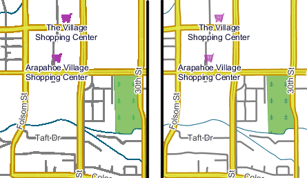

   PNG8 generado en versiones anteriores (izquierda) y mejoras a partir de la versión 2.2 (derecha)

* **image/geotiff**, incluye cabeceras con el sistema de referencia de coordenadas. Unido al resto de capacidades del servicio (reproyección, simbolización, filtrado), permite usar WMS como un servicio flexible de descarga de geodatos que luego podremos incorporar en nuestros SIG de escritorio. También incluye la variante de 8 bits, **image/geotiff8**.

* **image/svg**, recupera una imagen en formato vectorial, editable con software de edición vectorial y calidad óptima para imprenta.

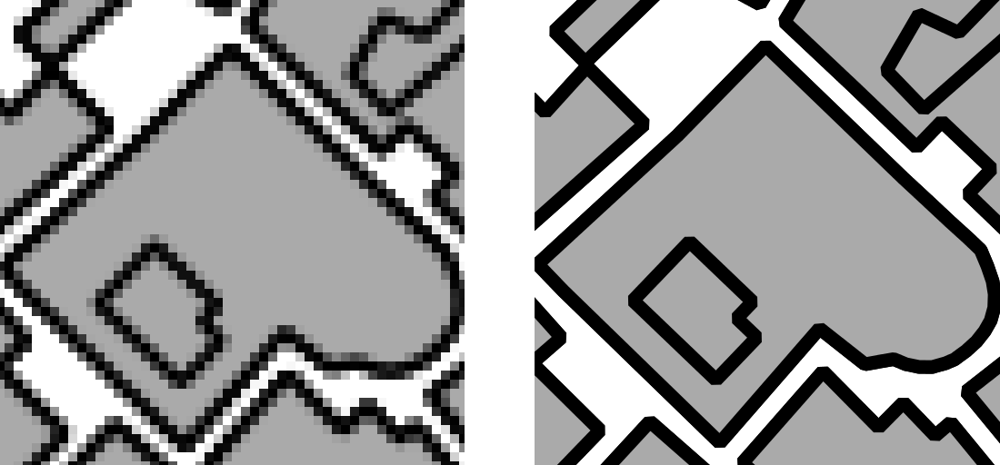

   Detalle de una petición WMS de 2.2 metros/píxel, en formato PNG (izquierda) y SVG (derecha).

* **application/pdf**, que también se generará en formato vectorial cuando las capas sean vectoriales. Ideal para generar documentos para su impresión en alta calidad.

* **application/rss** y **application/atom**, útil para suscribirse a capas cuyos datos cambien con el tiempo. Las geometrías se codifican en formato GeoRSS, de modo que un visor adecuado (como OpenLayers [#]_) se pueden mostrar los resultados sobre un mapa.

.. [#] http://openlayers.org/dev/examples/georss.html

* **kml** y **kmz**, permite ver el contenido en 3D en Google Earth. Dispone de varios parámetros específicos para controlar la manera como se obtienen los contenidos: incrementalmente utilizando networklinks, de forma rasterizada (descarga completa o mediante teselado *superoverlay*), de forma vectorial, etc. Combinado con las opciones de extrusión 3D de y marcas temporales, permite animaciones y vistas tridimensionales, como veremos más adelante.

* **application/openlayers** genera un visor completo basado en OpenLayers a partir de una simple petición WMS. Es la opción que utiliza |GS| en su **layer preview**. Proporciona un método muy sencillo de incrustar visores en otras páginas web, enviarlos como enlace en un correo electrónico, etc.

Parámetros específicos
----------------------

Además de los parámetros WMS estándar, |GS| proporciona una colección de parámetros específicos que extienden su funcionalidad. Generalmente estos parámetros se utilizan ligados a algún caso de uso concreto. Es decir, la mayoría de ellos no tiene sentido usarlos en cualquier petición. Veamos algunos de los más interesantes:

* **angle**, permite orientar la imagen.

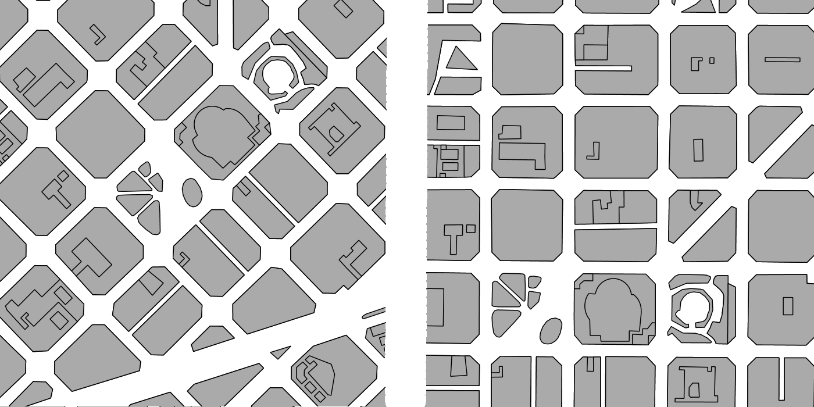

   Petición WMS orientada al norte (izquierda) y con un ángulo de 45 grados (derecha).

* **cql_filter**, permite seleccionar qué geometrías quieren mostrarse, mediante unas sintaxis de filtrado (CQL y ECQL) muy compactas pero potentes. Por ejemplo, para obtener los elementos en un radio de 250 metros respecto a un punto dado::

  cql_filter=DWITHIN(the_geom, POINT (431198 4581563), 250, meters)

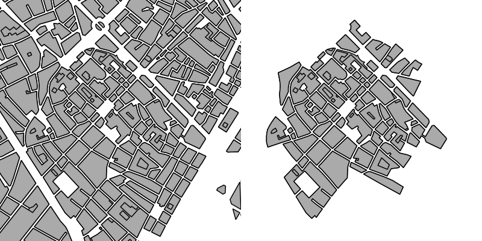

   Capa original (izquierda) y con el filtro de ejemplo aplicado (derecha).

Dedicaremos un apartado más adelante a ver sus posibilidades, entre las que se incluyen filtrados geométricos y temporales.

* **env**, permite especificar un conjunto de valores que se utilizarán para la simbolización personalizada. Los valores dependerán de cómo se contruya el SLD de visualización. Por ejemplo, podemos escoger qué símbolo se utilizará para un tipo de elemento, su tamaño y color. Veremos ejemplos en el apartado dedicado a simbolización.

Decoraciones
------------

En una imagen generada mediande WMS, además del propio contenido del mapa, nos puede interesar añadir alguna información contextual como la escala gráfica o numérica, la leyenda, e incluso textos e imágenes personalizadas.

Para ello, |GS| proporciona una manera de definir composiciones o *layouts* [#]_. 

.. [#] http://docs.geoserver.org/latest/en/user/advanced/wmsdecoration.html

Por ejemplo, el siguiente *layout* define tres decoraciones (leyenda, escala gráfica e imagen personalizada):

.. code-block:: xml

  <layout>
    <decoration type="legend" affinity="top,right" offset="12,12" size="auto"/>

    <decoration type="scaleline" affinity="bottom,right" offset="12,12" size="auto"/>

    <decoration type="image" affinity="bottom,center" offset="12,12" size="360,64">
      <option name="url" value="layouts/geomatico.png"/>
    </decoration>
  </layout>

Los ficheros de *layout* deben guardarse en ``GEOSERVER_DATA_DIR/layouts/nombre.xml`` , e invocarse mediante ``&FORMAT_OPTIONS=layout:nombre`` en la petición WMS.

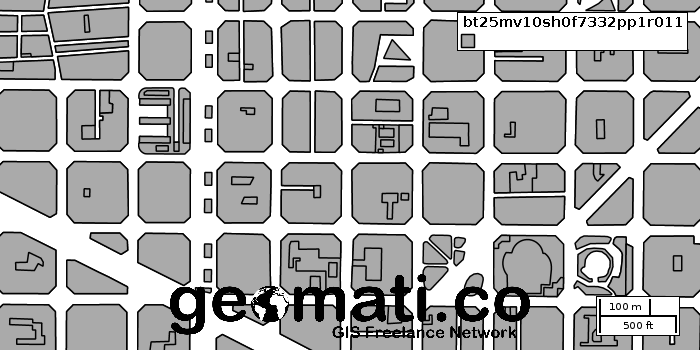

   Resultado obtenido de aplicar el *layout* anterior a una petición WMS.

Animaciones
-----------

Aunque se base en el protocolo WMS, este servicio es completamente específico de GeoServer, y se utiliza para generar GIFs animados. utiliza dos parámetros:

* **aparam**: El parámetro que se desea animar. Puede ser cualquiera de los parámetros WMS, pero también cualquiera de los parámetros específicos de |GS|. Esto permite animar la posición, proyección, tamaño, tiempo, estilo, parámetros de estilo (env), ángulo, decoraciones, etc.

* **avalues**: una lista de valores que debe tomar el parámetro para cada uno de los *frames* del GIF animado::

  http://localhost:8080/geoserver/wms/animate
  ?layers=<capa>
  &aparam=<parameto>
  &avalues=<valores>

Como se observa, la dirección de base ya no es ``/geoserver/wms``, sino ``geoserver/wms/animate``. 

Se pueden especificar las siguentes opciones de formato (**format_options**):

* **gif_loop_continuosly**: Para repetir la animación indefinidamente, o ejecutarla una sola vez.
* **gif_frames_delay**: El tiempo (en milisegundos) entre dos frames. Controla la velocidad de la animación.

Estas animaciones sólo se pueden generar en formato GIF.

Altura y tiempo
---------------

|GS| es capaz de gestionar también los parámetros de altura y de tiempo. Existen dos maneras distintas de gestionar estas dimensiones, según si utilizamos los formatos de imagen clásicos, o queremos generar un fichero KML para su visualización en Google Earth.

Datos Vectoriales
.................

Al publicar una capa vectorial, podemos definir el tiempo o la altura de cada *feature* mediante la pestaña *dimensions* en las propiedades de la capa.

Para que se habilite la dimensión temporal, debe existir al menos un atributo de tipo *date* o *timestamp*. También se puede definir un rango de tiempo, que puede ser fijo (como en la figura) o venir determinado por un segundo atributo temporal que marcará el fin del período.

Al realizar una petición WMS, se utilizará el parámetro ``TIME=`` para visualizar las *features* de un instante dado. O bien, puede definirse un rango utilizando ``/`` como separador. Por ejemplo, ``TIME=1984/2001`` indicaría *muéstrame todas las *features* ente los años 1984 y 2001*.

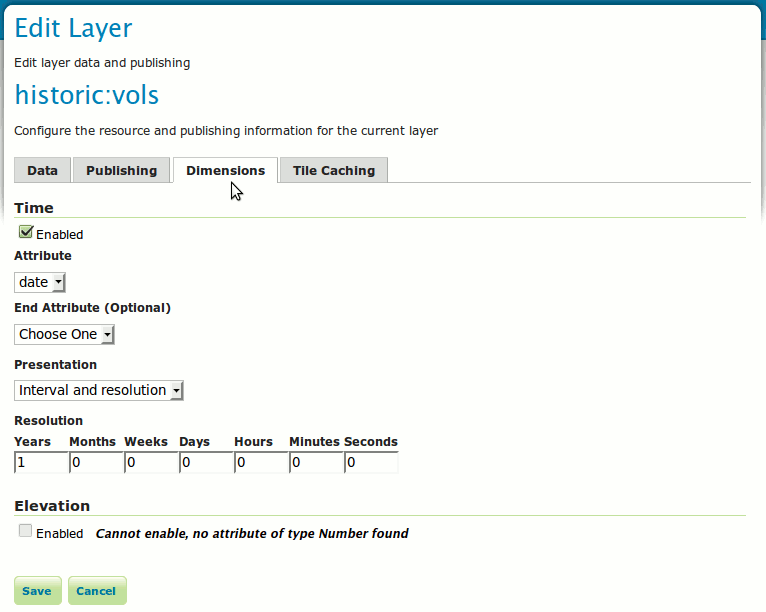

   Pestaña *dimensions* en las propiedades de una capa vectorial.

De forma análoga, para poder habilitar la dimensión de altura, debe existir al menos un atributo de tipo numérico. Igualmente, puede definirse un rango de alturas utilizando un segundo atributo numérico. En las peticiones WMS, se utilizará el parámetro ``ELEVATION=`` para indicar un valor de elevación, o un rango utilizando el separador ``/``.

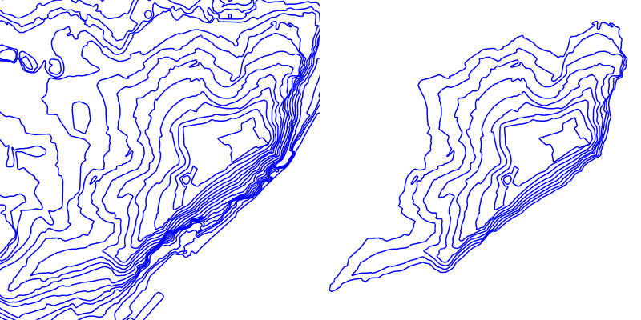

   Capa de curvas de nivel sin parámetro elevación (izquierda), y con un filtro de elevación (derecha).

**Atención**, si en una petición WMS de una capa temporal no se indica ningún parámetro ``TIME``, la respuesta WMS contendrá sólamente las *features* más recientes. Igualmente, en una capa de elevaciones sin parámetro ``ELEVATION``, sólo se mostrarán aquellas de menor elevación. En el documento de *GetCapabilities* del servicio WMS se podrán consultar las listas de valores válidos tanto de altura como de tiempo para cada capa.

Datos Raster
............

Los datos raster con tiempos y alturas son algo más complejos de configurar. Cada instante temporal o de altura vendrá representado por un ficher distinto. Puesto que no existe una tabla con atributos que pueda indicar a |GS| el tiempo o altura correspondiente a cada fichero, habrá que generar un índice a partir de los nombres de los archivos.

Así, indicaremos mediante una expresión regular qué parte del nombre de archivo corresponde a una fecha o una altura. Por ejemplo, a partir de esta colección de ortofotos históricas::

  historic-1990.tif
  historic-1993.tif
  historic-1996.tif
  historic-2000.tif
  historic-2003.tif
  historic-2004.tif
  historic-2006.tif
  historic-2008.tif
  historic-2009.tif
  historic-2010.tif

Crearemos un fichero ``timeregex.properties`` cuyo contenido será::

  regex=[0-9]{4}

Cuya interpretación es: El tiempo viene determinado por cuatro cifras consecutivas en el nombre de archivo. Así, |GS| capturará los valores 1990, 1993, 1996, 2000, 2003, 2004, 2006, 2008, 2009 y 2010 como instantes temporales en el momento de publicar esta capa. En caso de utilizar datos con periodicidad mensual o diaria, debe modificarse la expresión regular.

Estos valores se guardarán en un fichero SHP que actuará como índice, cuya estructura se define mediante un fichero llamado ``indexer.properties``::

  Schema=the_geom:Polygon,location:String,time:java.util.Date
  TimeAttribute=time
  PropertyCollectors=TimestampFileNameExtractorSPI[timeregex](time)

Que se lee:

 #. Genera un índice con tres campos: La geometría poligonal de cada imagen, el nombre del archivo, y el tiempo.
 #. El camo que indica el tiempo es el de nombre *time*.
 #. Para rellenar el campo *time*, aplica la exprexion regular del fichero ``timeregex.properties``.

Generalmente basta con crear el archivo ``indexer.properties`` y pegar el contenido aquí indicado, tal cual.

Por último, la capa se publicará como un **ImageMosaic**, y se comprobará que en la pestaña *dimensions* está habilitada la dimensión que corresponda.

Formato KML
...........

Uno de los visores más adecuados para representar datos de altura y tiempo es Google Earth, y por tanto, es muy conveniente poder aprovechar estas dimensiones en el formato KML. Por motivos históricos, KML no aprovecha las definiciones de la pestaña *dimensions*, y debemos definirlas mediante ficheros de plantilla en el directorio de datos de geoserver.

**Nota**: Según las pruebas realizadas, esta funcionalidad sólo está disponible para capas vectoriales.

Por ejemplo, situándose en ``GEOSERVER_DATA_DIR/workspaces/<workspace>/<store>/<layer>``, crear el fichero ``time.ftl``::

  ${date.rawValue}

Esto indica que el valor de tiempo viene definido en el atributo *date*. Entonces, utilizando el reflector KML, generamos los datos::

  http://localhost:8080/geoserver/wms/kml?layers=<capa>&mode=download

Y obtendremos un KML que, en Google Earth, hará aparecer el control de selección y animación temporal:

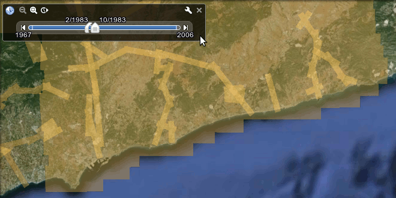

   Control temporal en Google Earth, generado a partir de una capa de |GS|.

Filtrado de datos
=================

Introducción
------------

El estandar WFS o Web Feature Service implementado por la OGC es un servicio que permite el intercambio de geometrías, **features**, a través de la web. La diferencia principal con el WMS, o Web Map Service, es que este servicio WFS devuelve como respuesta un grupo de geometrías que permitirán al usuario realizar operaciones utilizando estas directamente, mientras que con el WMS solo tiene acceso a la representación espacial de estas geometrías. En ambos servicios el estandar define el parámetro **filter** mediante el uso del cual podremos realizar filtrado de los resultados a mostrar o descargar. 

OGC describe el estandar Filter Encoding[#]_, donde define la sintáxis que se puede utilizar para construir expresiones que permitan la consulta de estos y otros servicios. De la misma manera se describe el estandar CQL o Common Query Language[#]_. Este se desarrolla como un lenguaje formal para desarrollar consultas con las que poder obtener información de sistemas como indices web, catálogos bibliográficos... La ventaja respecto del Filter Encoding es que se trata de un lenguaje más intuitivo, de lectura y definición más amigable, sin perder en ningún caso todo el potencial. Este estandar se creó para la especificación de Catálogo de la OGC[#]_.

|GS| implementa ambos estándares, tanto el Filter Encoding, como el CQL en una versión extendida denominada ECQL definida dentro del proyecto GeoTools[#]_.

Uso de filtrado en servicios WMS y WFS
--------------------------------------

El manejo de estos lenguajes de filtrado se realiza a través de las peticiones a los servicios. En el caso del uso del Filter Encoding, el parametro necesario es **filter** en ambos. Este parámetro está incluido dentro del estandar. La definición de las consultas se realiza mediante el uso de etiquetas de una manera similar a como manejaríamos un archivo XML. Por ejemplo, una consulta sencilla sería construida de esta manera::

	<PropertyIsEqualTo>
		<PropertyName>NOMBRE</PropertyName>
		<Literal>Valor</Literal>
	</PropertyIsEqualTo>
	   
En la anterior consulta se está indicando que se devuelva todas aquellas geometrías cuya propiedad NOMBRE = Valor. Para incluir esta consulta en la petición simplemente::

	http://localhost:8080/geoserver/namespace/wms?LAYERS=layer%3Aalayer&STYLES=&FORMAT=image%2Fpng&SERVICE=WMS&VERSION=1.1.1&REQUEST=GetMap&SRS=EPSG%3A4326&FILTER=<PropertyIsEqualTo><PropertyName>NOMBRE</PropertyName><Literal>Valor</Literal></PropertyIsEqualTo>&BBOX=-139.84870868359,18.549281576172,-51.852562316406,55.778420423828&WIDTH=780&HEIGHT=330
	
Al tratarse en este caso de una petición GET donde nos apoyamos en la URL para realizar la consulta, la expresión del filtro deberá codificarse de tal manera que pueda ser enviada dentro de esta URL.

Si se hecha un vistazo a la referencia del estandar Filter Encoding, podremos conocer las diferentes estructuras en las que nos permite apoyarnos para la construcción de los predicados. Por citar algunas tendremos:

	* Operadores de comparación.
		* Operadores binarios de comparación
		* Operador PropertyIsLike
		* ...
	* Operadores espaciales.
		* Intersects
		* Disjoint
		* Operador BBOX
	* Operadores lógicos
	* Expresiones

.. note:: En ningún caso es objetivo de este artículo mostrar la totalidad del estandar Filter Encoding por lo que se recomienda la revisión de este para un mejor entendimiento.

La construción de predicados apoyandose en este estandar puede convertirse en una operación compleja debido al manejo de las etiquetas de las diferentes operaciones. Por ejemplo, mediante esta operación estaríamos solicitando aquellas geometrías que cumpliesen diferentes predicados::

	<And>
		<Intersects xmlns:gml="http://www.opengis.net/gml">
			<PropertyName>the_geom</PropertyName>
			<gml:LineString><gml:coordinates>-125.68909683702887,50.174101053227751 -73.113095687349627,25.904513103468322 -73.113095687349627,25.904513103468322 -71.75127512103046,29.50361031445469</gml:coordinates></gml:LineString>
		</Intersects>
		<PropertyIsGreaterThan>
			<PropertyName>MALE</PropertyName>
			<PropertyName>FEMALE</PropertyName>
		</PropertyIsGreaterThan>
	</And>
	
CQL (Common Query Language) permite el manejo de consultas de una manera similar. En caso de querer representar la misma expresión básica del ejemplo anterior haremos::

	NOMBRE = Valor
	
como se puede observar la síntaxis es mucho más amigable, intentando equipararse a lenguajes de consulta más extendidos como el SQL.
Para ejecutar esta consulta en el servidor simplemente deberemos acompañar las peticiones con el parámetro **CQL_FILTER**::

	http://localhost:8080/geoserver/namespace/wms?LAYERS=layer%3alayer&STYLES=&FORMAT=image%2Fpng&SERVICE=WMS&VERSION=1.1.1&REQUEST=GetMap&SRS=EPSG%3A4326&CQL_FILTER=NOMBRE%20%3D%20'Valor'&BBOX=-139.84870868359,18.549281576172,-51.852562316406,55.778420423828&WIDTH=780&HEIGHT=330
	
|GS| implementa una extensión del lenguaje CQL denominada **ECQL**. Se puede ver una referencia del lenguaje en la documentación de GeoTools[#]_, proyecto bajo el que se ha desarrollado esta extensión. 

Si representasemos la expresión anterior mediante el lenguaje ECQL tendríamos::

	INTERSECTS(the_geom, LINESTRING(-125.68909683702887 50.174101053227751, -73.113095687349627 25.904513103468322, -73.113095687349627 25.904513103468322, -71.7512751210304629.50361031445469)) AND MALE > FEMALE

Más allá de los estándares OGC
==============================

Seguridad
---------

Uno de los principales problemas que plantea el uso de datos geoespaciales en el entorno corporativo es la privacidad de los datos. Muchas veces los datos y/o servicios no son públicos, únicamente son accesibles para ciertas personas o bien sólo una persona puede publicarlos. Para solucionar este tipo de problemas, Geoserver proporciona un sofisticado sistema de seguridad que permite, entre otras muchas alternativas, la administración múltiple de datos y servicios [#]_.

.. [#] **MUELLER, C.**, 2012, *Flexible authentication for stateless web services* http://geoserver.org/display/GEOS/Flexible+Authentication+for+Stateless+Web+Services

El sistema de seguridad de Geoserver se basa en varios conceptos sencillos y muy comunes en la mayoría de los sistemas multiusuario: usuarios, grupos de usuarios y roles. Además, Geoserver incorpora el concepto de espacio de trabajo, que no es más que un contenedor que organiza datos y servicios. De esta manera, Geoserver proporciona un sistema de seguridad basado en roles, donde los permisos de lectura escritura y administración de los datos, servicios o espacios de trabajos se determinan mediante roles y estos roles son asignados a los usuarios o grupos de usuarios. 

Es precisamente gracias a los espacios de trabajo por lo que es posible la administración múltiple del servidor. Geoserver permite la posibilidad de dar permisos de administración sobre un espacio de trabajo a un determinado rol. De este modo, se puede permitir a un usuario añadir, eliminar, configurar y, en general, administrar datos y servicios sin que interfiera con otros espacios de trabajos que pueden estar completamente ocultos y administrados por otros usuarios con diferente rol. En cierto modo, puesto que cada espacio de trabajo crea sus propios endpoints WMS/WFS/WCS por separado, es posible considerar el conjunto de espacios de trabajo como varios servidores independientes ejecutándose sobre una sola instancia de GeoServer.

APIs REST
---------

|GS| dispone de una interfaz RESTful a través de la cual los clientes pueden manejar las diferentes funciones simplemente mediante llamadas HTTP. De esta manera se podrá configurar |GS| sin necesidad de acceder al Interfaz de administración web. 

REST, REpresentational State Transfer, se trata de una interfaz web simple que se basa en el uso de XML y HTTP. Permite leer y escribir datos en el servidor utilizando estos protocolos.

Las operaciones en los recursos están implementadas usando las funciones de HTTP: GET, PUT, POST y DELETE. En REST, cada recurso está definido por una URL. 

|GS| implementa REST y pone a disposición del usuario una API con la que acceder a las diferentes funciones. Mediante el uso de esta API, podremos automatizar muchas de las necesidades habituales que surgen a menudo en el manejo de |GS|, como la publicación de grandes cantidades de archivos...

Uso de la API REST
..................

Para acceder a la funcionalidad de la API REST de |GS| deberemos ejecutar nuestras peticiones contra::

	../geoserver/rest/
	
Hemos de tener en cuenta algunos detalles sobre el uso de la API, como los estados manejados en las peticiones HTTP (200, 201, 403...) que nos indicarán el resultado de las operaciones que estamos ejecutando, y el tipo de contenido, formatos, con los que vamos a estar trabajando (application/xml, application/json...) tanto en las peticiones como en las respuestas.

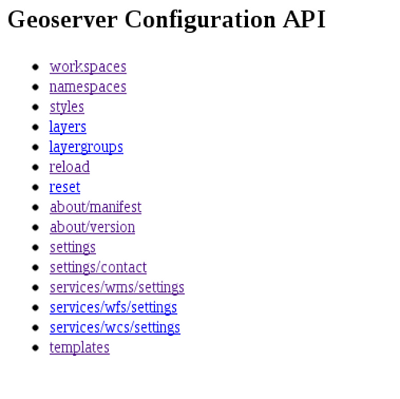

   /geoserver/rest accediendo a la API desde el navegador
   
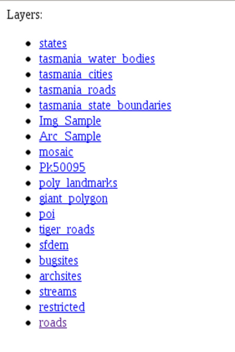

   /geoserver/rest/layers listado de capas
	
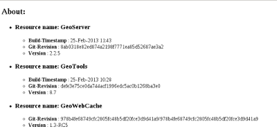

   /geoserver/rest/layers listado de capas
   	
Por ejemplo para la publicación de un archivo ESRI Shapefile[#]_, haciendo uso de cURL[#]_, herramienta que nos permitirá realizar las peticiones a través del protocolo HTTP haciendo uso de los métodos POST, PUT...

Siguiendo por partes el proceso, realizaremos:

Creación de un espacio de trabajo (workspace)::
	
	curl -v -u admin:password -XPOST -H "Content-type: text/xml" -d "<workspace><name>test</name></workspace>" http://localhost:8080/geoserver/rest/workspaces
	
	-v modo verbose
	-u usuario:contraseña
	-XPOST tipo de petición POST
	-H cabecera
	-d datos
   
Si la respuesta muestra un código 201 nuestro recurso se habrá creado satisfactoriamente. Podremos examinar este recurso accediendo desde un navegador a /geoserver/rest/workspaces o ejecutando::

	curl -v -u admin:password -XGET http://.../geoserver/rest/workspaces
	
Una vez que hemos creado nuestro espacio de trabajo procedemos a la carga del recurso::

	curl -v -u admin:password -XPUT -H "Content-type: application/zip" --data-binary @roads.zip http://localhost:8080/geoserver/rest/workspaces/test/datastores/roads/file.shp
	
	-XPUT tipo de petición PUT
	--data-binary @path_al_archivo
	
La URL se contruye /geoserver/rest/workspaces/<nombre del namespace>/datastores/<nombre del recurso>/file.shp.

Podremos comprobar el resultado de la operación accediendo al recurso mediante::

	curl -v -u admin:password -XGET /geoserver/rest/workspaces/test/datastores/roads.xml

Para una descripción mas intensiva de todas las operaciones que soporta la API REST de |GS| revisar la documentación[#]_
	
Extensiones
===========

[Micho] *Muy* breve listado y descripción de las extensiones más destacables, sean oficiales o community (ver gdoc). Con especial mención de formatos vía extensiones de BDD propietarias, ImageIO-ext

Conclusiones
============

Considerar que |GS| es un servidor de mapas WMS es tener una visión muy reducida de las posibilidades que ofrece. |GS| es una herramienta que nos permite publicar en la red prácticamente cualquier colección de datos geográficos, y obtenerlos remotamente prácticamente en cualquier formato que necesitemos: no sólamente imágenes estáticas, sino también imágenes animadas, datos vectoriales, documentos para impresión, *feeds* de suscripción a cambios, visualización 3D y 4D mediante KML, etc.

Además, |GS| permite simbolizar, filtrar y decorar los datos a voluntad, incluso permitiendo a los usuarios controlar . Con la extesión WPS, además podremos multiplicar enormemente las posibilidades de simbolización de los datos, que pueden transformarse al vuelo combinando decenas de operaciones.

Todo esto se realiza utilizando al máximo los estándares OGC y extendiéndolos cuando ha sido necesario, y, allí donde OGC no alcanza, utilizando otros formatos y protocolos habituales en la web, como las APIs REST.

Así, |GS| es un catálogo y repositorio de datos en línea, más un conjunto de herramientas para procesarlos y acceder a ellos de tantas formas como sea posible, y sacando el máximo provecho de los estándares OGC.

Este artículo sólo muestra las características que hemos considerado más destacables, pero existen muchas otras que por falta de espacio no podemos mostrar, y que se encuentran descritas en el manual de usuario del proyecto [#]_.

.. [#] http://docs.geoserver.org/stable/en/user/
